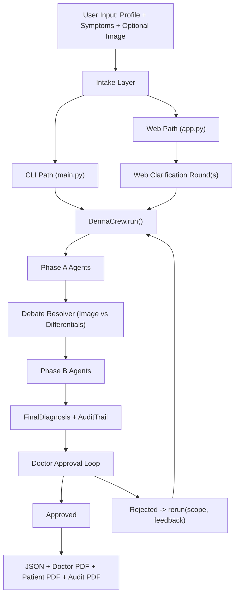
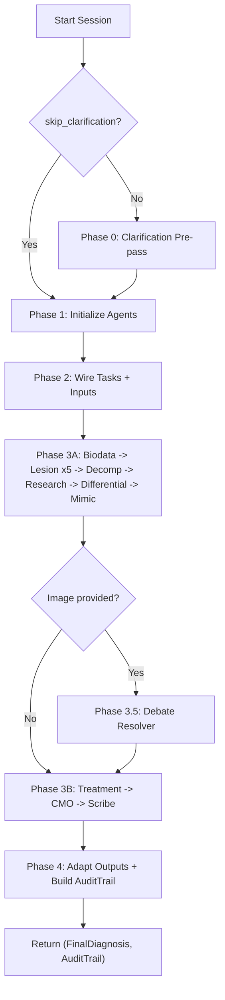
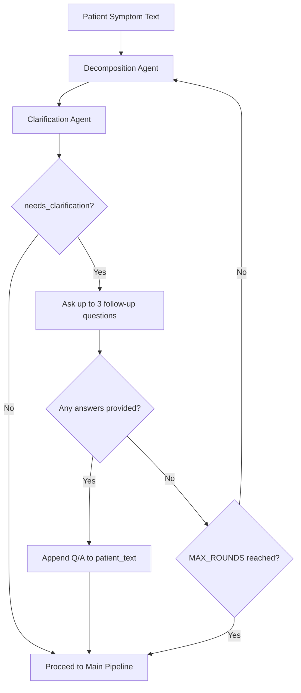
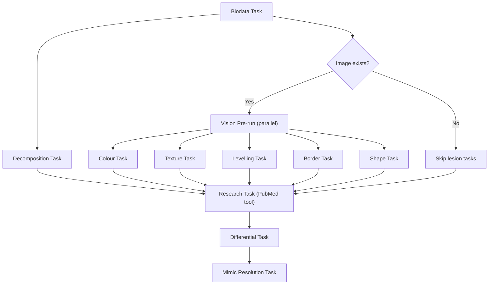
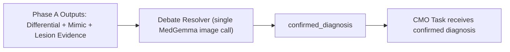
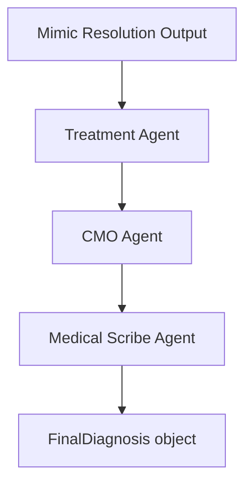
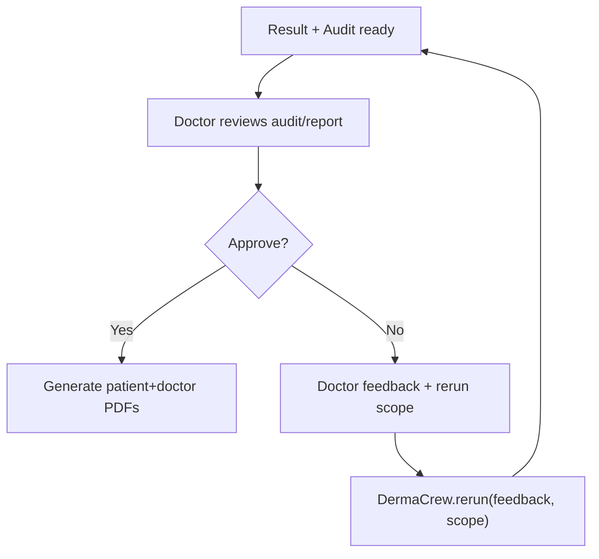
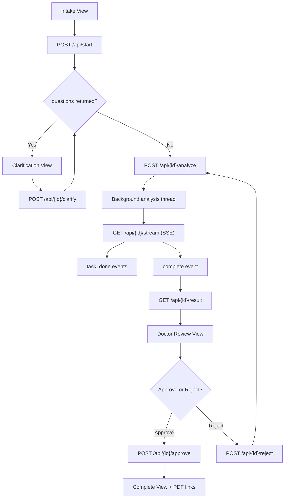
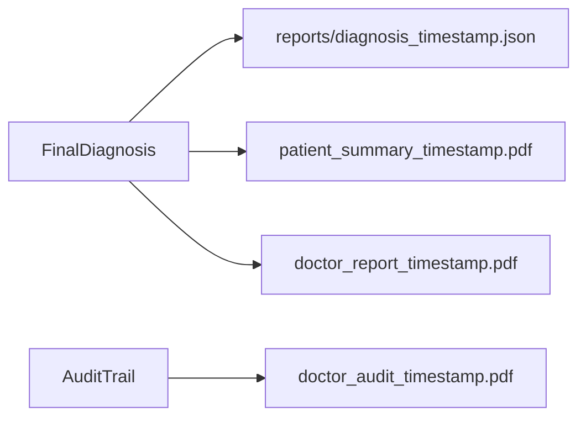

# AgenticDermaAI

A multi-agent dermatology decision-support system built with CrewAI, Ollama-hosted LLMs, and PubMed evidence retrieval.  
It accepts patient profile data, symptom text, and optionally a lesion image, then runs a staged clinical reasoning pipeline to produce:

- a patient-friendly summary
- a doctor-facing report
- a full audit trail report of the agent workflow

> Medical disclaimer: This project is for informational and clinical workflow support only. It is not a substitute for licensed medical diagnosis or treatment.

---

## Project Purpose

The project is designed to make dermatology triage and reasoning more transparent by splitting reasoning into specialized agents instead of one monolithic prompt.  
Key goals:

- improve diagnostic transparency by exposing intermediate outputs
- reduce single-model failure modes via phased, role-specific reasoning
- ground decisions with PubMed-backed evidence
- keep a doctor-in-the-loop with approval/rejection and rerun feedback

---

## What This System Does

At a high level:

1. Collects patient profile + symptoms + optional image
2. Runs clarification when critical fields are missing
3. Runs a two-phase multi-agent diagnostic pipeline
4. Performs a visual arbitration pass (Debate Resolver) between phases
5. Produces final structured diagnosis + reports
6. Supports doctor approval or feedback-driven reruns
7. Provides both CLI and FastAPI web app interfaces

---

## High-Level Architecture



---

## End-to-End Agentic Workflow

### Pipeline Stage Map



### Clarification Loop (CLI Path)



### Phase A Sequence



### Debate Resolver Insertion Point



### Phase B Sequence



### Doctor Approval and Rerun Loop



---

## Every Agent and How It Works

The runtime includes both CrewAI agents and one direct visual arbitration component.

### Agent Catalog

| Component | File | Model | Role | Main Input Context | Output Shape |
|---|---|---|---|---|---|
| Biodata Agent | `agents/biodata_agent.py` | `TEXT_LLM` (`qwen2.5:7b-instruct`) | Serves patient profile context | `patient_profile.json` | structured text summary |
| Colour Agent | `agents/lesion_agents.py` | `VISION_LLM` (MedGemma) | Lesion color interpretation | image + biodata | free-text color assessment (adapted to `ColourOutput`) |
| Texture Agent | `agents/lesion_agents.py` | `VISION_LLM` (MedGemma) | Surface/texture interpretation | image + biodata | free-text surface assessment (adapted to `SurfaceOutput`) |
| Levelling Agent | `agents/lesion_agents.py` | `VISION_LLM` (MedGemma) | Raised/flat/depressed morphology | image + biodata | free-text elevation assessment (adapted to `LevellingOutput`) |
| Border Agent | `agents/lesion_agents.py` | `VISION_LLM` (MedGemma) | Border and edge characteristics | image + biodata | free-text border assessment (adapted to `BorderOutput`) |
| Shape Agent | `agents/lesion_agents.py` | `VISION_LLM` (MedGemma) | Geometric lesion form | image + biodata | free-text shape assessment (adapted to `ShapeOutput`) |
| Decomposition Agent | `agents/decomposition_agent.py` | `ORCHESTRATOR_LLM` (`qwen2.5:7b-instruct`) | Extracts structured symptoms/history | symptom text + optional biodata context | free-text extraction (adapted to `DecompositionOutput`) |
| Clarification Agent | `agents/clarification_agent.py` | `VISION_LLM` (MedGemma) | Detects missing critical fields and asks follow-ups | decomposition output (+ optional biodata) | free-text clarification decision (adapted to `ClarificationOutput`) |
| Research Agent | `agents/research_agent.py` | `ORCHESTRATOR_LLM` (`qwen2.5:7b-instruct`) | PubMed evidence synthesis | lesion summary + biodata + decomposition | free-text research summary (adapted to `ResearchSummary`) |
| Differential Agent | `agents/clinical_agents.py` | `ORCHESTRATOR_LLM` (`qwen2.5:7b-instruct`) | Ranked differential with for/against evidence | lesion outputs + decomp + research | free-text differential reasoning (adapted to `DifferentialDiagnosisOutput`) |
| Mimic Resolution Agent | `agents/clinical_agents.py` | `ORCHESTRATOR_LLM` (`qwen2.5:7b-instruct`) | Resolves top mimic conflict | differential + lesion outputs + research | free-text mimic verdict (adapted to `MimicResolutionOutput`) |
| Treatment Agent | `agents/clinical_agents.py` | `ORCHESTRATOR_LLM` (`qwen2.5:7b-instruct`) | Creates diagnosis-specific protocol | biodata + research + differential + mimic | free-text plan (adapted to `TreatmentPlanOutput`) |
| CMO Agent | `agents/orchestrator_agent.py` | `ORCHESTRATOR_LLM` (`qwen2.5:7b-instruct`) | Clinical authority synthesis using confirmed diagnosis | lesion summary + confirmed diagnosis + upstream outputs | free-text CMO reasoning (adapted to `CMOResult`) |
| Medical Scribe Agent | `agents/orchestrator_agent.py` | `ORCHESTRATOR_LLM` (`qwen2.5:7b-instruct`) | Produces final patient+doctor narrative payload | CMO + treatment + research | free-text report synthesis (adapted to `FinalDiagnosis`) |
| Debate Resolver (visual arbitration) | `agents/visual_differential_agent.py` | direct `ImageAnalysisTool` call to MedGemma | Single-call visual winner selection from candidates | image + primary diagnosis + differential candidates | `DebateResolverOutput` |

### How “Agent Thinking” Is Structured

Each agent is constrained by:

- a specialized `role`, `goal`, and `backstory`
- explicit task descriptions and expected outputs
- context wiring from upstream tasks
- post-task schema adaptation and resilience fallback

The system allows free-text generation for clinical reasoning quality, then enforces structure in a separate adapter layer.

### Agent-by-Agent “Thinking Pattern” (Detailed)

1. **Biodata Agent**
   - Thinks in terms of “what was explicitly provided vs missing”.
   - Never infers; only serves profile-grounded context.
2. **Lesion Specialists (Colour/Texture/Levelling/Border/Shape)**
   - Think independently on one visual dimension each.
   - Produce focused morphology observations instead of diagnosis.
3. **Decomposition Agent**
   - Converts narrative symptom language into structured clinical fields.
   - Prioritizes duration, location, progression, triggers, and exposures.
4. **Clarification Agent**
   - Checks if critical fields are missing (`body_location`, `time_days`, `onset`, `progression`).
   - Asks minimal patient-facing questions to close critical gaps.
5. **Research Agent**
   - Synthesizes short, high-signal PubMed queries from morphology + history.
   - Extracts supporting and contradicting evidence and PMIDs.
6. **Differential Agent**
   - Builds ranked alternatives with explicit evidence-for and evidence-against.
   - Adds distinguishing tests and urgent red flags.
7. **Mimic Resolution Agent**
   - Compares top confusable diagnoses and isolates the decisive differentiator.
8. **Debate Resolver**
   - Re-checks candidate list directly against image and chooses one winner.
9. **Treatment Agent**
   - Produces tiered protocol tied to diagnosis and patient constraints.
10. **CMO Agent**
    - Synthesizes final clinical authority output around confirmed diagnosis and total evidence.
11. **Medical Scribe Agent**
    - Converts CMO+treatment into patient-readable and doctor-ready final report payload.

---

## Additional Tools and Supporting Code

### Core Tools

| Tool | File | Purpose |
|---|---|---|
| `ImageAnalysisTool` | `tools/image_tool.py` | Base64-encodes image and calls Ollama vision model for clinical image analysis |
| `PubMedSearchTool` | `tools/pubmed_tools.py` | Queries Entrez/PubMed and returns summarized article metadata + abstracts |

### Reliability and Schema Infrastructure

| Module | File | Purpose |
|---|---|---|
| Resilient JSON Sanitizer | `utils/resilient_base.py` | Cleans malformed LLM JSON artifacts before Pydantic validation |
| Schema Adapter | `utils/schema_adapter.py` | Converts free-text outputs to validated model objects with recovery/default fallback |
| Audit Model | `audit_trail.py` | Stores all intermediate and final outputs for traceability |

### Orchestration and Review Utilities

| Module | File | Purpose |
|---|---|---|
| Clarification Loop (CLI) | `utils/clarification_loop.py` | Interactive follow-up Q&A before full run |
| Clarification Loop (Web) | `utils/clarification_loop_web.py` | Non-blocking web clarification rounds |
| Doctor Review Loop | `doctor_approval.py` | Approve/reject flow with rerun scope selection |
| PDF Services | `pdf_service.py` | Generates audit PDF, doctor report PDF, and patient summary PDF |

### Runtime Interfaces

| Interface | File | Purpose |
|---|---|---|
| CLI Runner | `main.py` | Terminal workflow for full diagnosis + approval loop |
| FastAPI App | `app.py` | Browser-based intake, clarification, SSE progress, review, and PDF download |

---

## Web App Flow (FastAPI + SSE)



---

## Output Artifact Flow



---

## Install and Run on Any Machine

## 1) Prerequisites

- Python 3.11+ (3.11/3.12 recommended)
- Ollama installed and running
- Internet access for PubMed calls
- (Optional) Docker + Docker Compose for containerized deployment
- (Optional) NVIDIA GPU for faster inference

## 2) Clone and Create Environment

### Windows (PowerShell)

```powershell
git clone <your-repo-url>
cd AgenticDermaAI
python -m venv .venv
.\.venv\Scripts\Activate.ps1
pip install --upgrade pip
pip install -r requirements.txt
```

### macOS/Linux (bash/zsh)

```bash
git clone <your-repo-url>
cd AgenticDermaAI
python3 -m venv .venv
source .venv/bin/activate
pip install --upgrade pip
pip install -r requirements.txt
```

## 3) Environment Variables

Copy the template:

### Windows

```powershell
Copy-Item .env.example .env
```

### macOS/Linux

```bash
cp .env.example .env
```

Then set these in `.env`:

- `OLLAMA_BASE_URL`  
  - local native run: `http://localhost:11434`
  - docker-compose run: `http://ollama:11434`
- `NCBI_API_KEY` (PubMed)
- `NCBI_EMAIL` (PubMed Entrez requirement)
- `FORMATTER_MODEL` (default: `qwen2.5:7b-instruct`)
- `ELEVEN_API_KEY` (optional, only if you integrate TTS features)

## 4) Pull Required Ollama Models

```bash
ollama pull hf.co/unsloth/medgemma-1.5-4b-it-GGUF:Q4_K_M
ollama pull qwen2.5:7b-instruct
```

Check:

```bash
ollama list
```

## 5) Prepare Patient Profile (CLI and Web both use it)

```bash
python patient_setup.py
```

This writes `patient_profile.json`.

## 6) Run CLI Mode

```bash
python main.py
```

You will be prompted for:

- image path (optional)
- symptom description
- approval/reject cycle after first run

## 7) Run Web Mode

```bash
uvicorn app:app --host 0.0.0.0 --port 8000 --reload
```

Open: `http://localhost:8000`

## 8) Run with Docker Compose

From repo root:

```bash
docker compose up -d --build
```

After containers are healthy, pull models into the Ollama container:

```bash
chmod +x startup.sh
./startup.sh
```

Then open `http://localhost:8000`.

---

## Detailed End-to-End Example

This example follows one realistic case through all stages, including follow-up.

### Input

- Profile:
  - age: 34
  - sex: male
  - skin tone: medium-dark
  - occupation: painter
  - known allergies: nickel
- Symptom text:
  - “I have an itchy red rash on my forearm for 4 days, getting worse in evenings. I recently switched to a new solvent at work.”
- Image:
  - uploaded forearm lesion photo

### Step-by-Step Processing

1. **Clarification pre-pass**
   - Decomposition extracts core features.
   - Clarification detects missing `onset` and asks: “Did this start suddenly or gradually?”
   - User answers: “Started gradually two days after new solvent use.”
   - Enriched text is stored and used for main run.

2. **Biodata Agent**
   - Provides structured demographic and occupational context.

3. **Vision pre-run + Lesion Agents (parallel image interpretation source)**
   - Colour: erythematous with mild hyperpigmented background contrast.
   - Texture: fine scaling with mild dryness.
   - Levelling: slightly raised plaques.
   - Border: irregular but non-sharp transition.
   - Shape: patchy/oval clustered morphology.

4. **Decomposition Agent (main run)**
   - Produces structured symptoms: pruritus, forearm location, 4-day duration, worsening progression, occupational chemical exposure.

5. **Research Agent**
   - Constructs short PubMed query from lesion summary + exposure context.
   - Calls `pubmed_search` (max 2 calls enforced).
   - Returns evidence supporting contact dermatitis patterns in solvent-exposed workers; includes PMIDs.

6. **Differential Agent**
   - Ranks likely conditions:
     1) Allergic contact dermatitis
     2) Irritant contact dermatitis
     3) Nummular eczema
   - Includes supporting features, opposing features, and distinguishing tests.

7. **Mimic Resolution Agent**
   - Compares top mimic pair (allergic vs irritant contact dermatitis).
   - Uses morphology + history to confirm allergic contact dermatitis as stronger fit.

8. **Debate Resolver (visual arbitration)**
   - Receives image + candidate list.
   - Selects one authoritative visual winner.
   - Example outcome: confirms allergic contact dermatitis.

9. **Treatment Agent**
   - Builds tiered protocol, immediate actions, trigger avoidance, and follow-up recommendations, constrained by profile/allergy context.

10. **CMO Agent**
    - Uses confirmed diagnosis + evidence bundle.
    - Produces clinical reasoning, severity, confidence, investigations, PMIDs.

11. **Medical Scribe Agent**
    - Produces `FinalDiagnosis` with:
      - patient summary (plain language)
      - doctor notes (technical)
      - recommendations
      - seek-care guidance

12. **Audit and doctor loop**
    - `AuditTrail` captures all raw/adapted outputs.
    - Doctor can approve or reject with feedback and rerun scope.
    - On approval, doctor/patient/audit PDFs are generated.

### Example Final Outputs

- `FinalDiagnosis.primary_diagnosis`: Allergic Contact Dermatitis
- `FinalDiagnosis.confidence`: high
- `FinalDiagnosis.severity`: Moderate
- `FinalDiagnosis.patient_recommendations`: trigger avoidance + topical plan + follow-up window
- PDFs:
  - doctor clinical report
  - patient summary
  - full AI audit trail

---

## Rerun Scopes (Doctor Rejection Flow)

- `full`  
  Re-executes the whole pipeline.
- `post_research`  
  Intended for downstream correction from differential onward.
- `orchestrator_only`  
  Intended for synthesis-level correction.

Current implementation injects doctor feedback (`DOCTOR_FEEDBACK`) and re-runs via `run(skip_clarification=True)`, preserving enriched patient text while updating clinical reasoning with explicit feedback.

---

## Repository Map

- `crew/derma_crew.py`: primary orchestrator (`run`, `rerun`)
- `agents/`: all agent factories and output schemas
- `tools/`: image and PubMed tools
- `utils/`: clarification loops, schema adapter, resilience helpers
- `app.py`: FastAPI + session + SSE API
- `main.py`: CLI workflow with doctor approval loop
- `pdf_service.py`: report generation
- `doctor_approval.py`: interactive doctor review logic
- `patient_setup.py`: profile bootstrap helper

---

## Notes for Contributors

- Keep agent prompts role-specific; avoid collapsing steps into one general agent.
- Preserve auditability: new logic should emit interpretable intermediate outputs.
- If you add schema fields, update:
  - relevant Pydantic models
  - adapter expectations
  - PDF rendering sections
  - web result rendering paths

