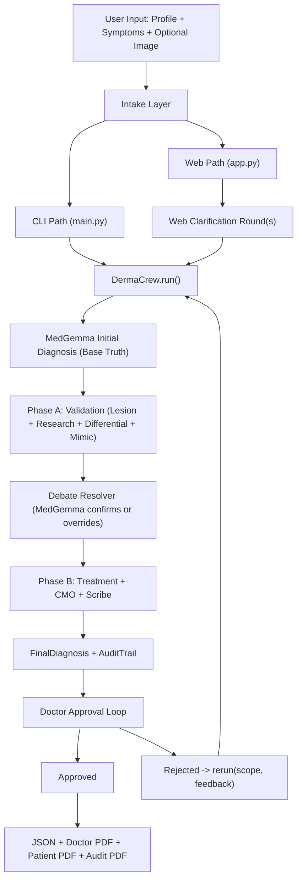
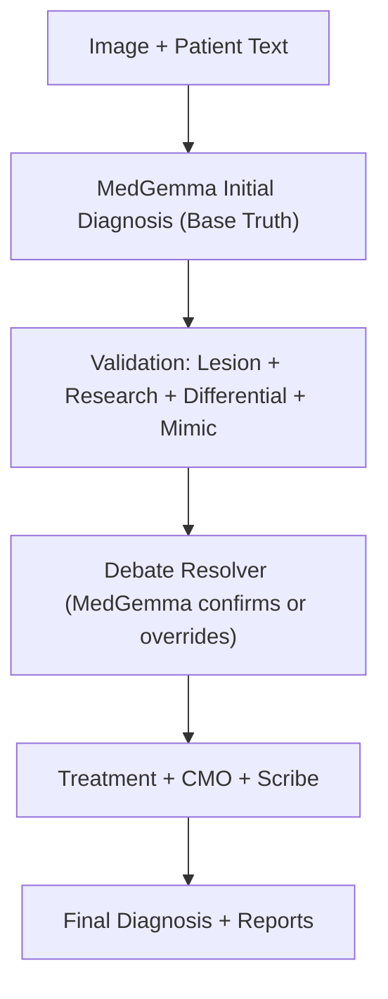
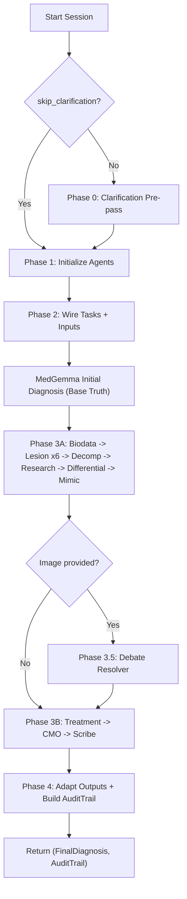
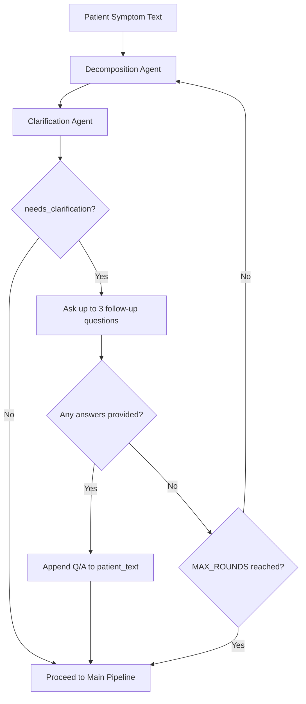
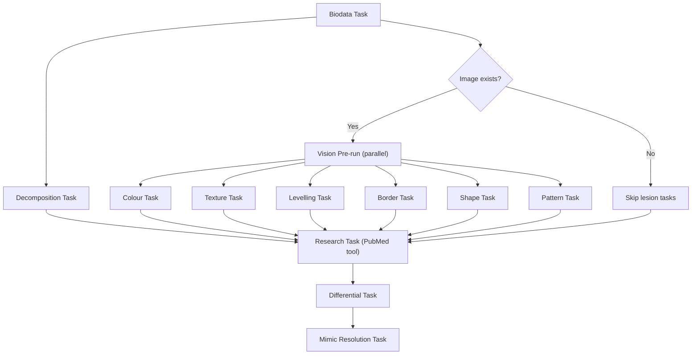
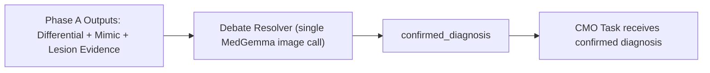
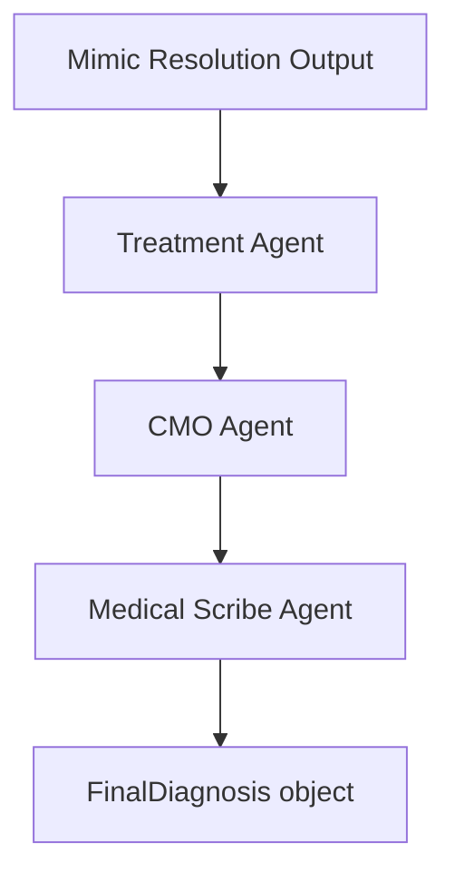
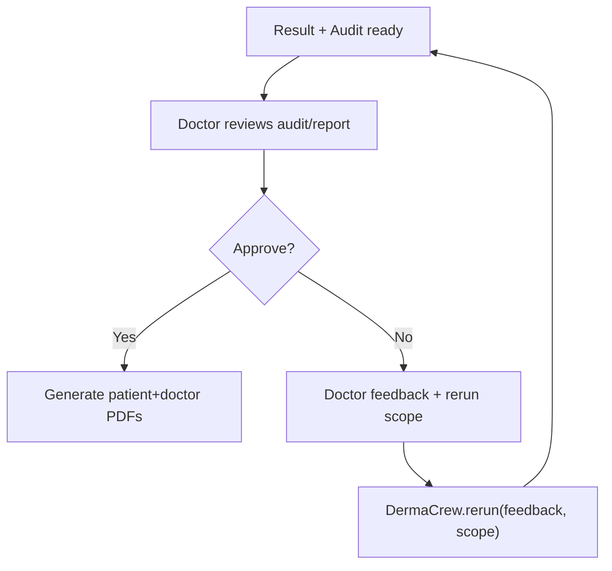
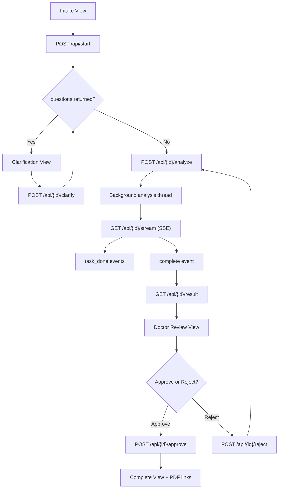
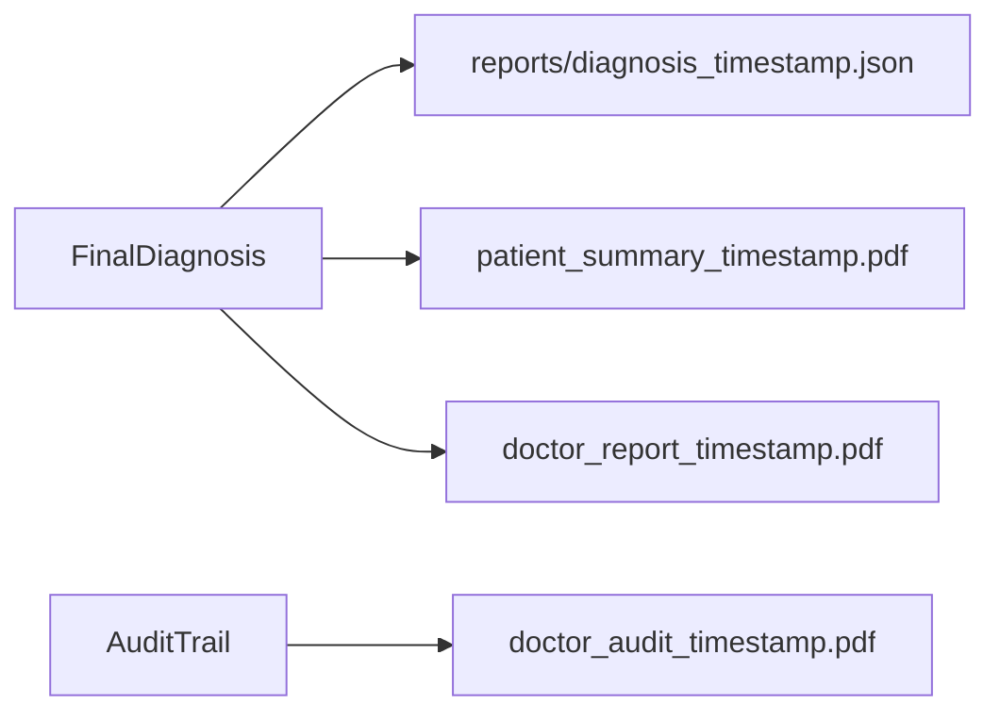

# AgenticDermaAI

A multi-agent dermatology decision-support system for skin lesion diagnosis. Built with CrewAI, Ollama-hosted MedGemma (vision), and PubMed evidence retrieval. The system uses **MedGemma's raw output as the base truth**, then deploys specialist agents to **prove or disprove** that diagnosis through morphology, literature, and differential reasoning.

Produces:

- a patient-friendly summary
- a doctor-facing report
- a full audit trail of the agent workflow

> Medical disclaimer: This project is for informational and clinical workflow support only. It is not a substitute for licensed medical diagnosis or treatment.

---

## Problem Statement

Dermatological diagnosis from skin lesion images and clinical history is a challenging task: many conditions share similar visual features (mimics), and a single label prediction often lacks the evidence trail clinicians need. Competitions and real-world use cases demand not only accuracy but interpretability—why this diagnosis, and what evidence supports or challenges it?

This project addresses that gap by treating the vision model's raw assessment as the **authoritative starting point**, then systematically validating it through specialist agents that gather evidence for or against the diagnosis.

---

## Our Approach: Vision as Base Truth + Agentic Validation

**MedGemma's raw output is the base truth.** The primary diagnosis comes directly from MedGemma examining the image and patient symptoms.

**The agentic workflow proves or disproves it.** Lesion specialists (colour, texture, border, shape, levelling, pattern), Research (PubMed), Differential, and Mimic agents gather evidence that **supports or challenges** MedGemma's diagnosis. They validate or refute it—they do not simply expand it.

**Debate Resolver.** MedGemma re-examines the image vs. the candidate list and makes the final call—confirming or overriding the initial diagnosis.

**Value for Kaggle and clinical use:**

- Higher accuracy: vision-led diagnosis validated by multi-agent evidence
- Structured, auditable outputs: full trail of what supported or contradicted the diagnosis
- Doctor-in-the-loop: approval, rejection, and feedback-driven reruns

---

## What This System Does

1. Collects patient profile + symptoms + optional image
2. Runs clarification when critical fields are missing
3. **MedGemma Initial Diagnosis** — base truth from image + symptoms
4. **Validation phase** — Lesion specialists, Decomposition, Research, Differential, Mimic agents gather evidence to prove or disprove the diagnosis
5. **Debate Resolver** — MedGemma re-examines image vs. candidates → confirmed diagnosis
6. **Synthesis phase** — Treatment, CMO, Scribe produce the final report around the confirmed diagnosis
7. Supports doctor approval or feedback-driven reruns
8. Provides both CLI and FastAPI web app interfaces

---

## High-Level Architecture



---

## Base Truth + Validation Flow



---

## How the Agentic Workflow Improves the Final Diagnosis

- **Proving or disproving**: Agents gather evidence (PubMed, lesion morphology, differentials) that **supports or contradicts** MedGemma's call. The Research Agent retrieves literature for and against; the Differential Agent builds ranked alternatives with explicit evidence-for and evidence-against; the Mimic Resolution Agent isolates factors that distinguish confusable conditions.

- **Accuracy**: The Debate Resolver resolves conflicts by re-examining the image against the candidate list. The CMO accepts the confirmed diagnosis and builds the clinical reasoning around it—unless doctor feedback explicitly requires a change.

- **Detail and verbosity**: Detailed reports (evidence summaries, differentials, treatment plans, patient summaries) emerge naturally from the validation process—they are outcomes of proving or disproving, not the primary goal.

---

## End-to-End Agentic Workflow

### Pipeline Stage Map



### Clarification Loop (CLI Path)



### Phase A Sequence (Validation)



### Debate Resolver Insertion Point



### Phase B Sequence



### Doctor Approval and Rerun Loop



---

## Every Agent and How It Works

The runtime includes both CrewAI agents and direct MedGemma calls for vision-based diagnosis and arbitration.

### Agent Catalog

| Component | File | Model | Role | Main Input Context | Output Shape |
|---|---|---|---|---|---|
| **MedGemma Initial Diagnosis** | `agents/visual_differential_agent.py` | MedGemma (direct call) | **Base truth** — primary diagnosis from image + symptoms | image + patient text | `MedGemmaInitialDiagnosis` |
| Biodata Agent | `agents/biodata_agent.py` | `TEXT_LLM` (`qwen2.5:7b-instruct`) | Serves patient profile context | `patient_profile.json` | structured text summary |
| Colour Agent | `agents/lesion_agents.py` | `VISION_LLM` (MedGemma) | Morphology evidence — colour interpretation | image + biodata | free-text color assessment (adapted to `ColourOutput`) |
| Texture Agent | `agents/lesion_agents.py` | `VISION_LLM` (MedGemma) | Morphology evidence — surface/texture | image + biodata | free-text surface assessment (adapted to `SurfaceOutput`) |
| Levelling Agent | `agents/lesion_agents.py` | `VISION_LLM` (MedGemma) | Morphology evidence — elevation | image + biodata | free-text elevation assessment (adapted to `LevellingOutput`) |
| Border Agent | `agents/lesion_agents.py` | `VISION_LLM` (MedGemma) | Morphology evidence — border/edge | image + biodata | free-text border assessment (adapted to `BorderOutput`) |
| Shape Agent | `agents/lesion_agents.py` | `VISION_LLM` (MedGemma) | Morphology evidence — geometric form | image + biodata | free-text shape assessment (adapted to `ShapeOutput`) |
| Pattern Agent | `agents/lesion_agents.py` | `VISION_LLM` (MedGemma) | Morphology evidence — configuration/pattern (annular, bullseye, etc.) | image + biodata | free-text pattern assessment (adapted to `PatternOutput`) |
| Decomposition Agent | `agents/decomposition_agent.py` | `ORCHESTRATOR_LLM` (`qwen2.5:7b-instruct`) | Extracts structured symptoms/history | symptom text + optional biodata context | free-text extraction (adapted to `DecompositionOutput`) |
| Clarification Agent | `agents/clarification_agent.py` | `VISION_LLM` (MedGemma) | Detects missing critical fields and asks follow-ups | decomposition output (+ optional biodata) | free-text clarification decision (adapted to `ClarificationOutput`) |
| Research Agent | `agents/research_agent.py` | `ORCHESTRATOR_LLM` (`qwen2.5:7b-instruct`) | **Evidence for/against** — PubMed synthesis | lesion summary + biodata + decomposition | free-text research summary (adapted to `ResearchSummary`) |
| Differential Agent | `agents/clinical_agents.py` | `ORCHESTRATOR_LLM` (`qwen2.5:7b-instruct`) | **Evidence for/against** — ranked differential with for/against | lesion outputs (colour, texture, levelling, border, shape, pattern) + decomp + research + MedGemma anchor | free-text differential reasoning (adapted to `DifferentialDiagnosisOutput`) |
| Mimic Resolution Agent | `agents/clinical_agents.py` | `ORCHESTRATOR_LLM` (`qwen2.5:7b-instruct`) | Distinguishes top confusable conditions | differential + lesion outputs + research + MedGemma anchor | free-text mimic verdict (adapted to `MimicResolutionOutput`) |
| **Debate Resolver** | `agents/visual_differential_agent.py` | MedGemma (direct call) | **Validation** — re-examines image vs. candidates, confirms or overrides | image + primary + differential candidates | `DebateResolverOutput` |
| Treatment Agent | `agents/clinical_agents.py` | `ORCHESTRATOR_LLM` (`qwen2.5:7b-instruct`) | Creates diagnosis-specific protocol | biodata + research + differential + mimic | free-text plan (adapted to `TreatmentPlanOutput`) |
| CMO Agent | `agents/orchestrator_agent.py` | `ORCHESTRATOR_LLM` (`qwen2.5:7b-instruct`) | Builds clinical reasoning around **confirmed diagnosis** | lesion summary + confirmed diagnosis + upstream outputs | free-text CMO reasoning (adapted to `CMOResult`) |
| Medical Scribe Agent | `agents/orchestrator_agent.py` | `ORCHESTRATOR_LLM` (`qwen2.5:7b-instruct`) | Produces final patient+doctor narrative payload | CMO + treatment + research | free-text report synthesis (adapted to `FinalDiagnosis`) |

### How Agent Roles Map to Prove/Disprove

- **MedGemma (Initial + Debate Resolver)**: Authoritative. Establishes base truth and makes the final visual call.
- **Lesion specialists**: Produce morphology evidence that supports or challenges the diagnosis.
- **Research Agent**: Retrieves PubMed evidence that supports or contradicts.
- **Differential Agent**: Builds ranked alternatives with explicit evidence-for and evidence-against; treats MedGemma anchor as default but can propose alternatives if evidence strongly contradicts.
- **CMO Agent**: Accepts the Debate Resolver's confirmed diagnosis; builds clinical reasoning around it. Does not override unless doctor feedback requires it.

---

## Additional Tools and Supporting Code

### Core Tools

| Tool | File | Purpose |
|---|---|---|
| `ImageAnalysisTool` | `tools/image_tool.py` | Base64-encodes image and calls Ollama vision model for clinical image analysis |
| `PubMedSearchTool` | `tools/pubmed_tools.py` | Queries Entrez/PubMed and returns summarized article metadata + abstracts |

### Reliability and Schema Infrastructure

| Module | File | Purpose |
|---|---|---|
| Resilient JSON Sanitizer | `utils/resilient_base.py` | Cleans malformed LLM JSON artifacts before Pydantic validation |
| Schema Adapter | `utils/schema_adapter.py` | Converts free-text outputs to validated model objects with recovery/default fallback |
| Audit Model | `audit_trail.py` | Stores all intermediate and final outputs for traceability |

### Orchestration and Review Utilities

| Module | File | Purpose |
|---|---|---|
| Clarification Loop (CLI) | `utils/clarification_loop.py` | Interactive follow-up Q&A before full run |
| Clarification Loop (Web) | `utils/clarification_loop_web.py` | Non-blocking web clarification rounds |
| Doctor Review Loop | `doctor_approval.py` | Approve/reject flow with rerun scope selection |
| PDF Services | `pdf_service.py` | Generates audit PDF, doctor report PDF, and patient summary PDF |

### Runtime Interfaces

| Interface | File | Purpose |
|---|---|---|
| CLI Runner | `main.py` | Terminal workflow for full diagnosis + approval loop |
| FastAPI App | `app.py` | Browser-based intake, clarification, SSE progress, review, and PDF download |

---

## Web App Flow (FastAPI + SSE)



---

## Output Artifact Flow



---

## Install and Run on Any Machine

## 1) Prerequisites

- Python 3.11+ (3.11/3.12 recommended)
- Ollama installed and running
- Internet access for PubMed calls
- (Optional) Docker + Docker Compose for containerized deployment
- (Optional) NVIDIA GPU for faster inference

## 2) Clone and Create Environment

### Windows (PowerShell)

```powershell
git clone <your-repo-url>
cd AgenticDermaAI
python -m venv .venv
.\.venv\Scripts\Activate.ps1
pip install --upgrade pip
pip install -r requirements.txt
```

### macOS/Linux (bash/zsh)

```bash
git clone <your-repo-url>
cd AgenticDermaAI
python3 -m venv .venv
source .venv/bin/activate
pip install --upgrade pip
pip install -r requirements.txt
```

## 3) Environment Variables

Copy the template:

### Windows

```powershell
Copy-Item .env.example .env
```

### macOS/Linux

```bash
cp .env.example .env
```

Then set these in `.env`:

- `OLLAMA_BASE_URL`  
  - local native run: `http://localhost:11434`
  - docker-compose run: `http://ollama:11434`
- `NCBI_API_KEY` (PubMed)
- `NCBI_EMAIL` (PubMed Entrez requirement)
- `FORMATTER_MODEL` (default: `qwen2.5:7b-instruct`)
- `ELEVEN_API_KEY` (optional, only if you integrate TTS features)

## 4) Pull Required Ollama Models

```bash
ollama pull hf.co/unsloth/medgemma-1.5-4b-it-GGUF:Q4_K_M
ollama pull qwen2.5:7b-instruct
```

Check:

```bash
ollama list
```

## 5) Prepare Patient Profile (CLI and Web both use it)

```bash
python patient_setup.py
```

This writes `patient_profile.json`.

## 6) Run CLI Mode

```bash
python main.py
```

You will be prompted for:

- image path (optional)
- symptom description
- approval/reject cycle after first run

## 7) Run Web Mode

```bash
uvicorn app:app --host 0.0.0.0 --port 8000 --reload
```

Open: `http://localhost:8000`

## 8) Run with Docker Compose

From repo root:

```bash
docker compose up -d --build
```

After containers are healthy, pull models into the Ollama container:

```bash
chmod +x startup.sh
./startup.sh
```

Then open `http://localhost:8000`.

---

## Detailed End-to-End Example

This example follows one realistic case through all stages, including follow-up.

### Input

- Profile:
  - age: 34
  - sex: male
  - skin tone: medium-dark
  - occupation: painter
  - known allergies: nickel
- Symptom text:
  - "I have an itchy red rash on my forearm for 4 days, getting worse in evenings. I recently switched to a new solvent at work."
- Image:
  - uploaded forearm lesion photo

### Step-by-Step Processing

1. **Clarification pre-pass**
   - Decomposition extracts core features.
   - Clarification detects missing `onset` and asks: "Did this start suddenly or gradually?"
   - User answers: "Started gradually two days after new solvent use."
   - Enriched text is stored and used for main run.

2. **MedGemma Initial Diagnosis (Base Truth)**
   - MedGemma examines image + patient text and outputs primary diagnosis (e.g., allergic contact dermatitis) with reasoning.

3. **Biodata Agent**
   - Provides structured demographic and occupational context.

4. **Lesion Agents (parallel) — morphology evidence**
   - Colour: erythematous with mild hyperpigmented background contrast.
   - Texture: fine scaling with mild dryness.
   - Levelling: slightly raised plaques.
   - Border: irregular but non-sharp transition.
   - Shape: patchy/oval clustered morphology.
   - Pattern: overall configuration (annular, bullseye/target-like, nummular, etc.) with diagnostic significance.

5. **Decomposition Agent (main run)**
   - Produces structured symptoms: pruritus, forearm location, 4-day duration, worsening progression, occupational chemical exposure.

6. **Research Agent — evidence for/against**
   - Constructs short PubMed query from lesion summary + exposure context.
   - Calls `pubmed_search` (max 2 calls enforced).
   - Returns evidence supporting contact dermatitis patterns in solvent-exposed workers; includes PMIDs.

7. **Differential Agent — evidence for/against**
   - Anchored by MedGemma's initial diagnosis.
   - Ranks likely conditions with supporting and opposing features:
     1) Allergic contact dermatitis
     2) Irritant contact dermatitis
     3) Nummular eczema
   - Includes distinguishing tests.

8. **Mimic Resolution Agent**
   - Compares top mimic pair (allergic vs irritant contact dermatitis).
   - Uses morphology + history to identify distinguishing factors.

9. **Debate Resolver (validation)**
   - MedGemma re-examines image vs. candidate list.
   - Confirms allergic contact dermatitis (or overrides if visual evidence contradicts).

10. **Treatment Agent**
    - Builds tiered protocol, immediate actions, trigger avoidance, and follow-up recommendations, constrained by profile/allergy context.

11. **CMO Agent**
    - Uses confirmed diagnosis + evidence bundle.
    - Produces clinical reasoning, severity, confidence, investigations, PMIDs.

12. **Medical Scribe Agent**
    - Produces `FinalDiagnosis` with:
      - patient summary (plain language)
      - doctor notes (technical)
      - recommendations
      - seek-care guidance

13. **Audit and doctor loop**
    - `AuditTrail` captures all raw/adapted outputs.
    - Doctor can approve or reject with feedback and rerun scope.
    - On approval, doctor/patient/audit PDFs are generated.

### Example Final Outputs

- `FinalDiagnosis.primary_diagnosis`: Allergic Contact Dermatitis
- `FinalDiagnosis.confidence`: high
- `FinalDiagnosis.severity`: Moderate
- `FinalDiagnosis.patient_recommendations`: trigger avoidance + topical plan + follow-up window
- PDFs:
  - doctor clinical report
  - patient summary
  - full AI audit trail

---

## Rerun Scopes (Doctor Rejection Flow)

- `full`  
  Re-executes the whole pipeline.
- `post_research`  
  Intended for downstream correction from differential onward.
- `orchestrator_only`  
  Intended for synthesis-level correction.

Current implementation injects doctor feedback (`DOCTOR_FEEDBACK`) and re-runs via `run(skip_clarification=True)`, preserving enriched patient text while updating clinical reasoning with explicit feedback.

---

## Repository Map

- `crew/derma_crew.py`: primary orchestrator (`run`, `rerun`)
- `agents/`: all agent factories and output schemas
- `agents/visual_differential_agent.py`: MedGemma Initial Diagnosis + Debate Resolver
- `tools/`: image and PubMed tools
- `utils/`: clarification loops, schema adapter, resilience helpers
- `app.py`: FastAPI + session + SSE API
- `main.py`: CLI workflow with doctor approval loop
- `pdf_service.py`: report generation
- `doctor_approval.py`: interactive doctor review logic
- `patient_setup.py`: profile bootstrap helper

---

## Notes for Contributors

- Keep agent prompts role-specific; avoid collapsing steps into one general agent.
- Preserve auditability: new logic should emit interpretable intermediate outputs.
- MedGemma outputs are the base truth; specialist agents prove or disprove—they do not override without strong evidence.
- If you add schema fields, update:
  - relevant Pydantic models
  - adapter expectations
  - PDF rendering sections
  - web result rendering paths
